# 1 为什么使用markdown

首先Markdown 是一种纯文本格式，因此特别适合于Git进行版本控制。
想象一个项目有一个图文并茂的描述文档，doc 格式，大小5M。

如果放到 Git 上，那么对这个文档的一丁点更改都会引起一个5M大小的二进制文件的改变。非常浪费。
如果放到网盘上，那么这个文档就会丢失大量的版本信息。重要的改动经常需要手动备份来保留。非常麻烦。

用Markdown后，文档就和代码一样是一行行的纯文本；图片之类的资源是外链的，不改动图片本身就不会产生提交。这就大大提高了版本控制的效率，文档可以像代码一样享受版本控制的优点。

# 2 markdown常用语法

## 2.1 标题

且一个文档中只能有一个最高级标题（否则markdownlint会疯狂警告）  
一级标题 #  
二级标题 ##  
三级标题 ###

## 2.2 换行

*回车空一行，在段落之间换行就完事了，会空一行  

段内换行需要在结尾插入两个以上的空格空格

## 2.3 斜体和粗体，删除线

要加粗的文字左右分别用两个*号包起来 **加粗**  
要倾斜的文字左右分别用一个号包起来 *加斜*  
要加删除线的文字左右分别用两个~~号包起来 ~~删除的文本~~  

## 2.4引用和注脚

在引用的文字前加>即可。引用也可以嵌套，如加两个>>三个>>>  
>引用的内容
>
>>进一步引用

使用 [^keyword] 表示注脚。  
 [^keyword]

## 2.5 分割线

三个或者三个以上的 - 或者 * 都可以以下是效果

---
---

## 2.6 添加图像

使用  插入图像。

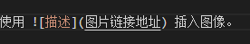

## 2.7 超链接和网站

注：Markdown本身语法不支持链接在新页面中打开，如果想要在新页面中打开的话可以用html语言的a标签代替。

[超链接名](超链接地址 "超链接title")title可加可不加
[简书](http://jianshu.com)  
直接网址用<网址>效果<http://baidu.com>

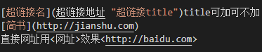

## 2.8 表格

表头|表头|表头
---|:--:|---:
内容|内容|内容
内容|内容|内容

姓名|技能|排行
--|:--:|--:
刘备|哭|大哥
关羽|打|二哥
张飞|骂|三弟

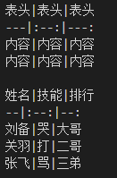

## 2.9 添加代码块

单行代码：代码之间分别用一个反引号包起来
`create database hero;`  
加三个```符号包围起来  
代码块前面加相关语言可实现语法高亮如等cpp python java等

```cpp
    function fun(){
         echo "这是一句非常牛逼的代码";
    }
    fun();
```

```c
files = os.listdir(".") 
for filename in files: 
    pos = filename.find("."); 
    if filename[pos+1:] == 'html': 
        newname = filename[:pos+1] + 'htm' 
        os.rename(filename,newname)
```

```python
    #!/usr/bin/python3
    print("Hello, World!")
```

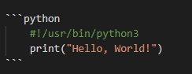

## 2.10 添加文件目录

在文章开始地方输入[toc]，即可在对应位置插入目录

# 3 使用vscode更好地编写markdown

Vs是信仰

## 3.1 vscode安装

必须安装的插件markdown preview Enhangced  
Chinese的汉化插件  
markdowlint检测语法正确和错误的

## 3.2 插入图片

安装Paste IMage插件
在配置里的修改文件的路径添加images，这样在同级的文件目录下会有一个images文件里面是图片
使用qq的截图后在使用ctrl+alt+v可以将图像添加进去

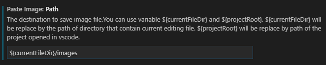

## 3.3 添加文件目录

在扩展安装安装成功后，点击左侧扩展图标，可查看已安装的扩展。如下图所示：
Markdown TOC
然后右键插入就行，这里会存在问题，是因为设置里auto修改为换行符
这里需要搜索eol修改文本编辑器的默认行尾字符尾巴后的为\n换行符

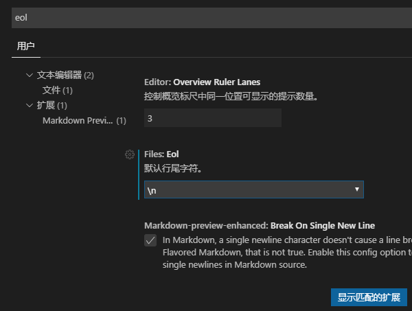

## 五.Typora编写

### 1.代码块的支持

目前Typora没有对默认支持代码块语言需要自己手动标注一下

添加通过添加'''c

代码区域

'''这种形式的方式进行c语言类型标注

原代码块标注前

`void main(){`

​	`print （”hello world“）;`

`}`

标注后

```c
void main(){
	print （”hello world);
} 
```


# 4 markdown上传和下载

这一部分主要解决如何将本地的markdown与云上的进行同步产生的图片丢失情况的数据

## 4.1 githup上传项目教程

上传githup的网站访问比较慢，不推荐  
本地编写markdown的时候，使用，在本地有个images的文件夹
然后把图片存在markdown文件同级目录的images文件夹，随着markdown文章一起上传，就能在github上看到
这里如何上传到githup整个自己的项目呢？
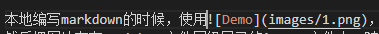

### 4.1.1 创建github repository(仓库)

### 4.1.2 安装git配置

ssh配置后才能上传文件
在git bash界面输入如下内容即可完成邮箱的注册：
>$ git config --global user.name "user.name"
（说明：双引号中需要你的用户名，这个可以随便输入，比如“zhangsan”）
查看是否存在密钥ssh keys
如果没设置，就创建新的ssh keys，不然git不能上传文件
$ssh-keygen -t rsa -C "你的邮箱名"

$指定目录: C:\deskbook\（说明：若在此处不输入路径，而直接按回车，则ssh keys生成后存放的路径为C:\User\.ssh）

$输入密码: 123456

$确认密码: 123456
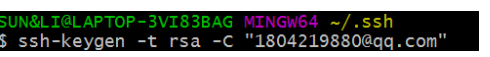
如此即可在C:\deskbook\文件夹中生成ssh keys。包括两个文件rd_rsa和id_rsa.pub
idb_rsa.pub（可以把后缀名改成.txt),登录自己的GitHub账号，找到Settings,添加公钥
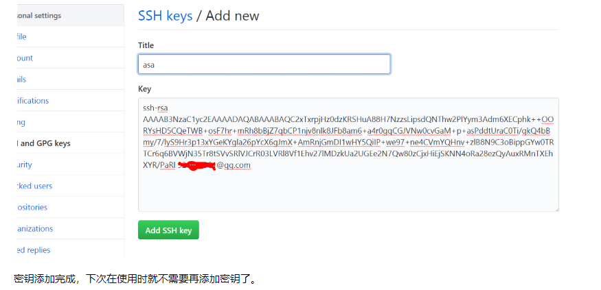

### 4.1.3 上传项目

1.在本地使用gitbash通过命令git init把这个文件夹变成Git可管理的仓库,里面多了个.git文件夹，它是Git用来跟踪和管理版本库的。如果你看不到，是因为它默认是隐藏文件，那你就需要设置一下让隐藏文件可见。
>git init

2.这时候你就可以把你的项目粘贴到这个本地Git仓库里面（粘贴后你可以通过git status来查看你当前的状态），
>git staus]

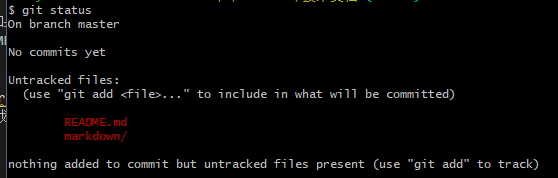

3.然后通过git add把项目添加到仓库（或git add .把该目录下的所有文件添加到仓库，注意点是用空格隔开的）。在这个过程中你其实可以一直使用git status来查看你当前的状态。如果文件内有东西会出现红色的字，不是绿色，这不是错误。
>git add

添加单个文件需要指定文件名称
>git add .
添加全部的修改过的文件

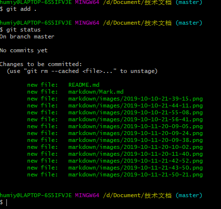

4.用git commit -m "日志" 把项目提交到仓库。
> git commit -m "日志名称"

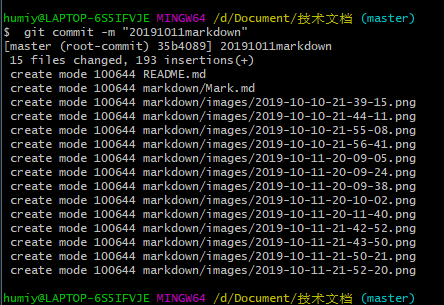

5.git remote add origin https://自己的仓库url地址，将本地的仓库关联到github上，

>git remote add origin https://github.com/humiyer/Document.git

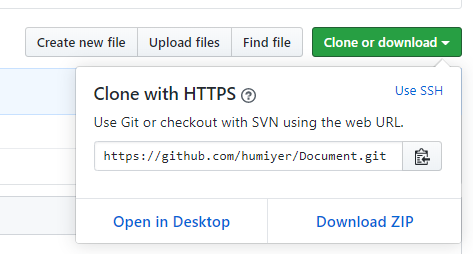

6.如果当前分支与多个主机存在追踪关系，则可以使用-u选项指定一个默认主机，git push。第一次使用后面就可以直接使用git push了 可能会需要密码
>git push -u origin master

git config --global credential.helper manager

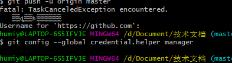

上面命令将本地的master分支推送到origin主机，同时指定origin为默认主机，后面就可以不加任何参数使用git push了。
>git push

另外，这里有个坑需要注意一下，就是在上面第七步创建远程仓库的时候，如果你勾选了Initialize this repository with a README（就是创建仓库的时候自动给你创建一个README文件），那么到了第九步你将本地仓库内容推送到远程仓库的时候就会报一个to  
error: src refspec master does not match any.
error: failed to push some refs to 'https://github.com/humiyer/Document.git'
这是由于你新创建的那个仓库里面的README文件不在本地仓库目录中，这时我们可以通过以下命令先将内容合并以下：将上githup的数据与本地合并
> git pull --rebase origin master

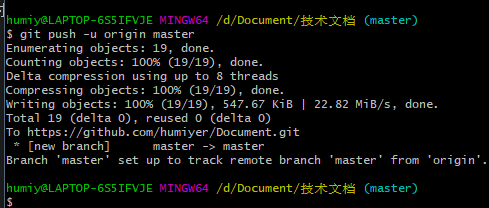

然后刷新githup界面就新项目了

7.在githup下载到本地拉取分支到本地

>git pull origin master

git pull需要先初始化本地文件夹文一个仓库,也就是要做到与上面一样的步骤

8.清理git的历史记录
随着git使用过多的原因

## 4.2 博客网站

## 4.3 上传到自己的服务器

