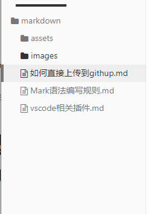
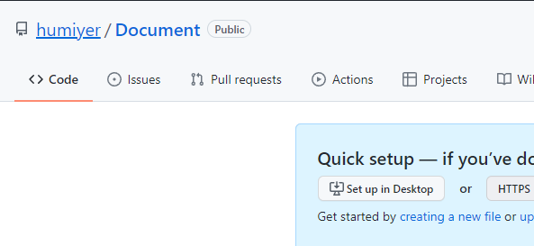
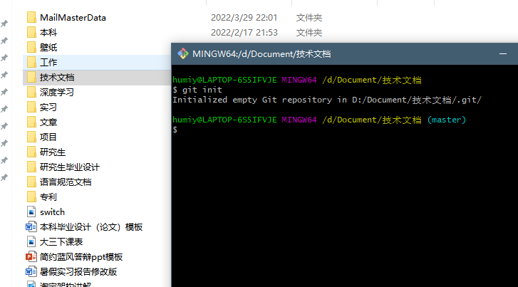
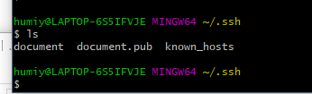
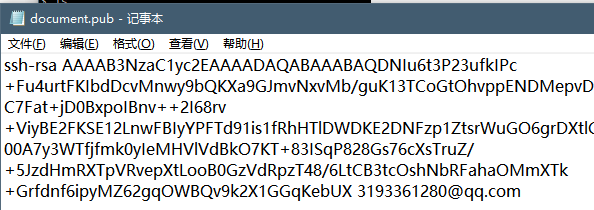
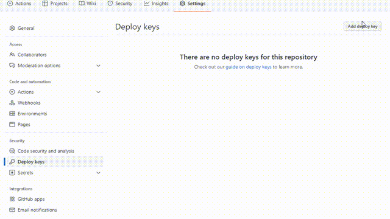

## 一.说明

​	对于一些优秀的笔记进行分享学习时如何将本地的markdown文件更好的与githup上传到进行云同步比较快捷。

​	markdown的图片与文字是分开的，本地编写时会有一个图床，在同一个项目名称下以typora软件在[assets]文件夹下面存储当前文件夹下所有markdown文件夹名称，在vscode编写下为images，后面统一为[assets]文件夹，以本文为例子




## 二.创建github repository(远程仓库)和本地库

这里在githup网站上创建一个了Docment文档的远程库



在本地初始化一个git仓库，右键文件夹目录运行git bash命令窗口

使用 命令   

```csharp
$   git init`  
```

   



也可以使用命令删除不要的git库
```csharp
$   rm -rf .git  
```


## 三.添加SSH Key到远程库

1.在打开的GIt Bash中输入以下命令（用户和邮箱为你github注册的账号和邮箱）

```csharp
$ git config --global user.name "hanyuntao"
$ git config --global user.email "hanyuntaocn@163.com"
```

可以先查看当前用户名和邮箱地址

```csharp
$ git config user.name
$ git config user.email
```

2.首先检查是否已生成密钥`cd ~/.ssh`，如果返回的`ls`有3个文件,则密钥已经生成。




没有的话重新生成

```ruby
ssh-keygen -t rsa -C "hanyuntaocn@163.com"邮箱名为githup上面的你
```

会依次输入文件名称 密码123456和确认密码三次后生成密钥文件


3.打开记事本的复制公钥docment.hup文件中




Githup新建的仓库上添加到公钥

